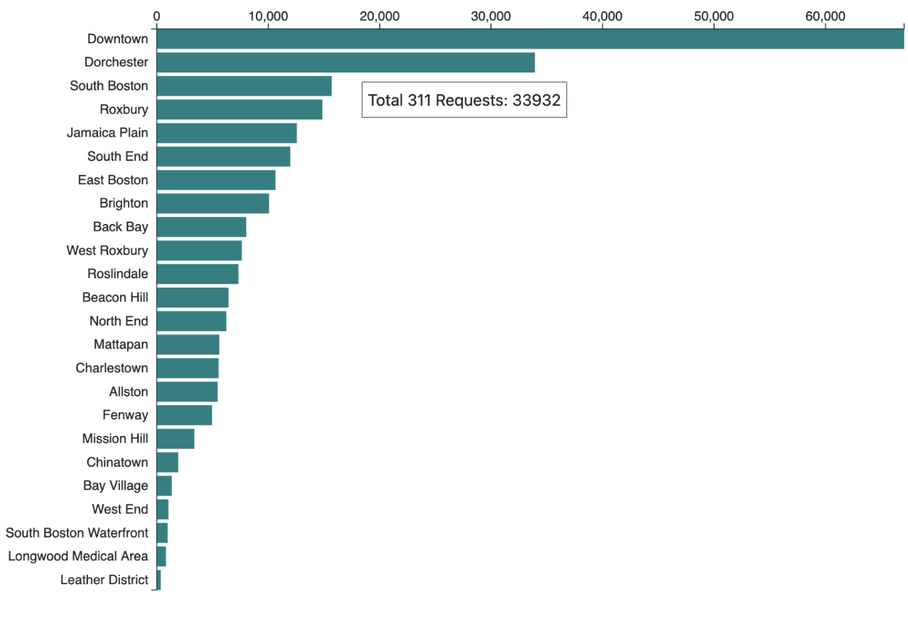
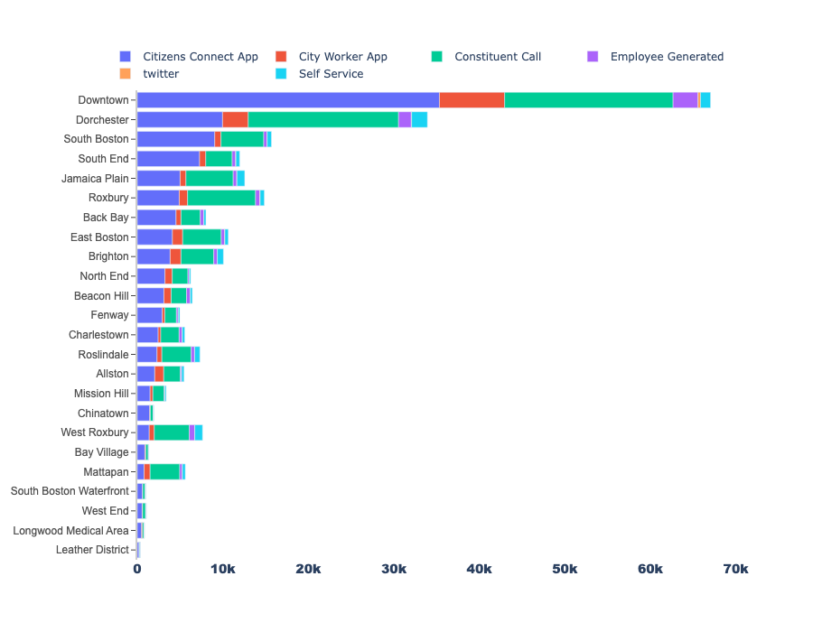

# Boston 311 Requests

## Creating a visualization from scratch that includes:

* **External CSV data:** Setting up your own web file structure and loading in external CSV data.
* **Dynamic Axes Scales:** Implementing dynamic scales in D3 to help style chart elements and improve legibility of your data visualization
* **Tooltips:** a tooltip on hover will allow the user to interact with chart elements to view details on specific neighborhoods

This visualization illustrates Boston 311 data as a horizontal bar chart that displays the total
counts of 311 requests per neighborhood.

The data has been provided  in the  boston_311.csv file.

The final web page end result should look something like this:

The total was brocken down in to its constituent sources below:

